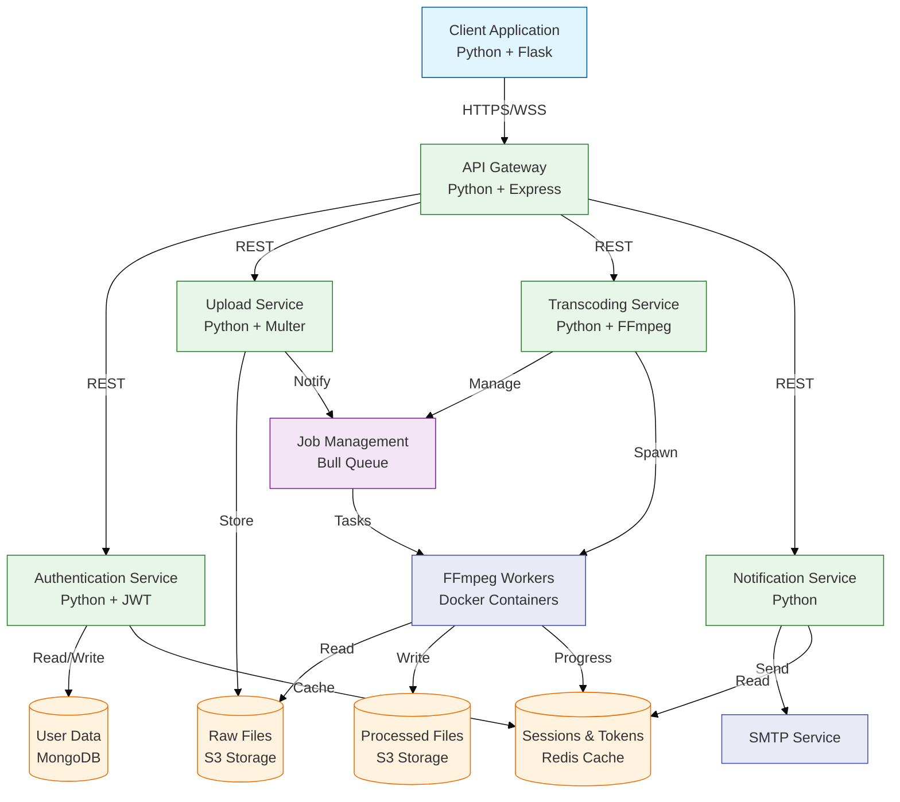

<!-- ./docs/architecture/architecture.md -->
Architectural Overview
======================

```mermaid
%%{init: {'theme': 'base', 'themeVariables': { 'edgeLabelBackground': '#ffffff00', 'labelTextColor': '#000000' }}}%%
graph TD
    %% Client Layer
    Client[Client Application
        Python + Flask]
    
    %% API Gateway
    APIGateway[API Gateway
        Python + Express]
    
    %% Authentication
    Auth[Authentication Service
        Python + JWT]
    MongoDB[(User Data
        MongoDB)]
    Redis[(Sessions & Tokens
        Redis Cache)]
    
    %% Upload Service
    Upload[Upload Service
        Python + Multer]
    S3Raw[(Raw Files
        S3 Storage)]
    
    %% Transcoding Service
    Transcoding[Transcoding Service
        Python + FFmpeg]
    Queue[Job Management
        Bull Queue]
    Workers[FFmpeg Workers
        Docker Containers]
    S3Processed[(Processed Files
        S3 Storage)]
    
    %% Notification Service
    Notification[Notification Service
        Python]
    EmailService[SMTP Service]
    
    %% Client Connections
    Client -->|HTTPS/WSS| APIGateway
    
    %% API Gateway Connections
    APIGateway -->|REST| Auth
    APIGateway -->|REST| Upload
    APIGateway -->|REST| Transcoding
    APIGateway -->|REST| Notification
    
    %% Auth Connections
    Auth -->|Read/Write| MongoDB
    Auth -->|Cache| Redis
    
    %% Upload Service Connections
    Upload -->|Store| S3Raw
    Upload -->|Notify| Queue
    
    %% Transcoding Service Connections
    Transcoding -->|Manage| Queue
    Transcoding -->|Spawn| Workers
    Queue -->|Tasks| Workers
    Workers -->|Read| S3Raw
    Workers -->|Write| S3Processed
    Workers -->|Progress| Redis
    
    %% Notification Service Connections
    Notification -->|Send| EmailService
    Notification -->|Read| Redis
    
    %% Styling
    classDef client fill:#e1f5fe,stroke:#01579b
    classDef service fill:#e8f5e9,stroke:#2e7d32
    classDef storage fill:#fff3e0,stroke:#ef6c00
    classDef queue fill:#f3e5f5,stroke:#7b1fa2
    classDef worker fill:#e8eaf6,stroke:#3f51b5
    
    class Client client
    class APIGateway,Auth,Upload,Transcoding,Notification service
    class MongoDB,Redis,S3Raw,S3Processed storage
    class Queue queue
    class Workers,EmailService worker
```