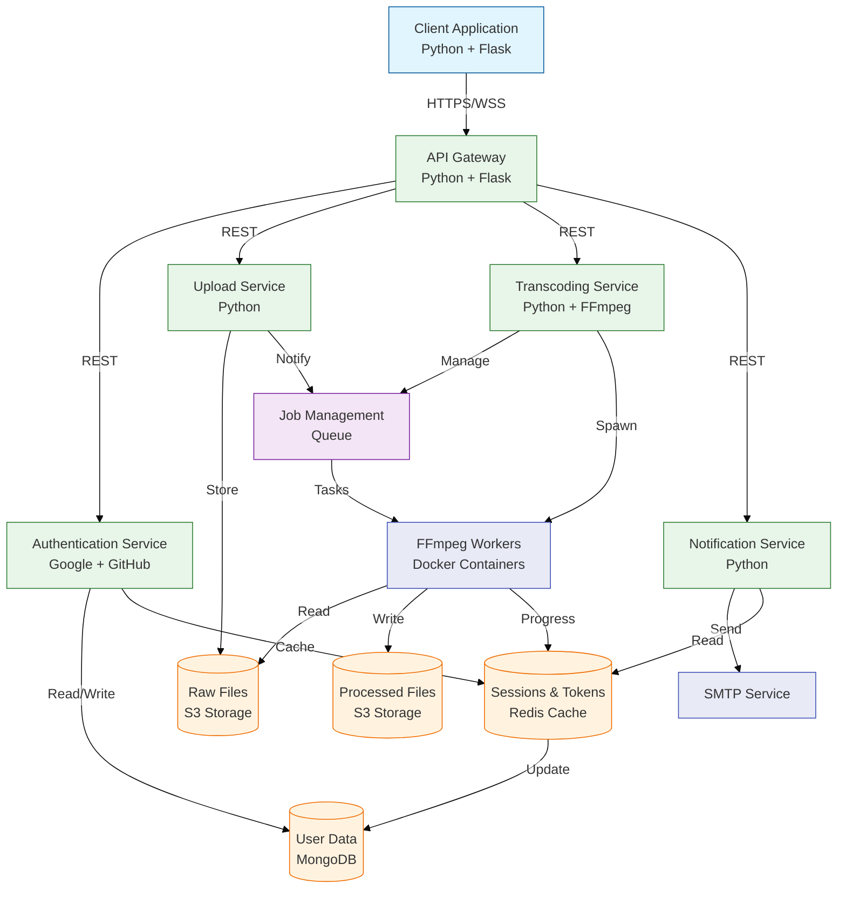

<!-- ./docs/architecture/architecture.md -->
# Media Transcoding Application Architecture

## Overview

This document describes the architecture of the cloud-native SaaS Media Transcoding application, built using a microservices pattern on AWS. The system is designed for scalability, reliability, and maintainability, leveraging containerization and asynchronous processing.

*(Based on Section 5 of the Final Project Report)*

## Components

* **Client:** Flask/HTML/JS frontend. Handles user interaction, OAuth login flow initiation, file selection, status polling, and history display.
* **API Gateway:** Flask service. Single entry point, JWT validation, request routing, coordinates uploads, queues Celery tasks, retrieves status/history from Redis.
* **Auth Service:** Flask service. Manages OAuth callbacks (Google/GitHub), exchanges codes for tokens, fetches user profiles, issues internal JWTs.
* **Upload Service:** Flask service. Receives file streams from API Gateway, uploads directly to the S3 `raw/` prefix.
* **Transcoding Service:** Celery worker. Downloads raw files from S3, executes FFmpeg for transcoding, uploads processed files to S3 `processed/` prefix, updates Redis metadata, triggers notifications.
* **Notification Service:** Celery worker. Receives tasks upon job completion, generates pre-signed S3 URLs, sends email notifications via SMTP/SES.
* **Redis (AWS ElastiCache):** In-memory data store used as Celery broker, Celery result backend, and for storing job metadata (status, details) and user job history lists.
* **S3:** Object storage for raw uploaded media files and processed output files. Lifecycle rules manage transitions to colder storage.
* **AWS ECS (Fargate):** Container orchestration service to run the application microservices without managing underlying EC2 instances.
* **AWS ALB:** Application Load Balancer distributes incoming traffic across stateless service instances (Client, API Gateway, Auth Service, Upload Service).

## Data Flow Diagram (Final)

*(Embed the final workflow diagram from the report - Section 5.2 - here. You can use markdown image syntax or link to the image file)*

*Diagram Description:*

1.  User selects file/format in Client UI.
2.  Client UI (JS) gets JWT via `/get-token` endpoint (served by Client Flask backend).
3.  Client UI sends upload request (file, format, email) with JWT to API Gateway (`/upload`).
4.  API Gateway validates JWT.
5.  API Gateway forwards file stream to Upload Service.
6.  Upload Service uploads file to S3 (`raw/` prefix) and returns the S3 key.
7.  API Gateway receives S3 key from Upload Service.
8.  API Gateway creates Job ID, stores initial metadata (PENDING) in Redis (job hash & user history list).
9.  API Gateway sends transcoding task message (payload includes job details, input S3 key) to Celery (via Redis broker).
10. API Gateway returns Job ID to Client UI.
11. Client UI starts polling API Gateway (`/status/{job_id}`) with JWT.
12. Transcoding Worker picks up task from Celery queue.
13. Transcoding Worker updates job status to PROCESSING in Redis.
14. Transcoding Worker downloads raw file from S3 (`raw/` prefix).
15. Transcoding Worker executes FFmpeg command.
16. Transcoding Worker uploads processed file to S3 (`processed/` prefix).
17. Transcoding Worker generates pre-signed download URL (optional, but good practice).
18. Transcoding Worker updates job status to COMPLETED in Redis (stores output S3 key, download URL).
19. Transcoding Worker sends notification task message (payload includes job details, output S3 key) to Celery (via Redis broker).
20. Notification Worker picks up task.
21. Notification Worker generates pre-signed URL for the output S3 key.
22. Notification Worker sends email via SMTP/SES with download link.
23. Client UI polling `/status/{job_id}` eventually receives COMPLETED status (with optional download URL). Client UI can also fetch `/jobs` to refresh history display.

## Technology Choices Rationale

*(Summarize Section 4.2 from the report)*

* **Python/Flask:** Lightweight, rapid development, strong ecosystem.
* **Celery/Redis:** Robust, standard Python solution for background tasks and message queuing. Redis also serves as an efficient metadata cache.
* **Docker:** Consistent environments, simplified deployment, dependency isolation (FFmpeg).
* **FFmpeg:** Industry standard for media manipulation.
* **AWS (ECS/Fargate, S3, ElastiCache, ALB):** Mature, scalable, managed cloud services reducing operational overhead. Fargate provides serverless container execution.
* **Terraform:** Infrastructure-as-Code for repeatable, automated provisioning and management of cloud resources.

## Scalability, Availability, Performance

*(Summarize Section 7 from the report)*

* **Scalability:** Independent scaling of microservices (ECS Service Auto Scaling), Celery worker scaling, Fargate serverless scaling, S3/ElastiCache inherent scalability.
* **Availability:** Microservice fault isolation, ALB distribution across AZs, ECS self-healing, AWS Managed Services high availability, Celery retries.
* **Performance:** Asynchronous processing via Celery, low-latency Redis lookups, direct S3 interactions by workers, potential FFmpeg optimizations.

Architectural Overview
======================

