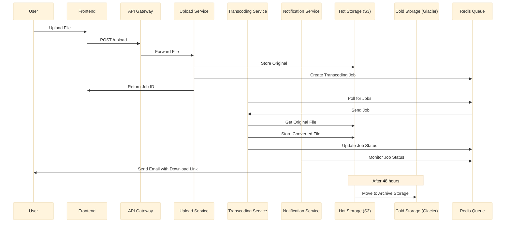

<!-- ./docs/architecture/data-flow.md -->
The data flow diagram:

```mermaid
%%{init: {'theme': 'base', 'themeVariables': { 'edgeLabelBackground': '#ffffff00', 'labelTextColor': '#000000', 'noteBkgColor': '#fff3e0', 'noteTextColor': '#000000' }}}%%
sequenceDiagram
    participant U as User
    participant FE as Frontend
    participant AG as API Gateway
    participant US as Upload Service
    participant TS as Transcoding Service
    participant NS as Notification Service
    participant Hot as Hot Storage (S3)
    participant Cold as Cold Storage (Glacier)
    participant Q as Redis Queue

    U->>FE: Upload File
    FE->>AG: POST /upload
    AG->>US: Forward File
    US->>Hot: Store Original
    US->>Q: Create Transcoding Job
    US->>FE: Return Job ID
    
    TS->>Q: Poll for Jobs
    Q->>TS: Send Job
    TS->>Hot: Get Original File
    TS->>Hot: Store Converted File
    TS->>Q: Update Job Status
    
    NS->>Q: Monitor Job Status
    NS->>U: Send Email with Download Link
    
    Note over Hot,Cold: After 48 hours
    Hot->>Cold: Move to Archive Storage
```